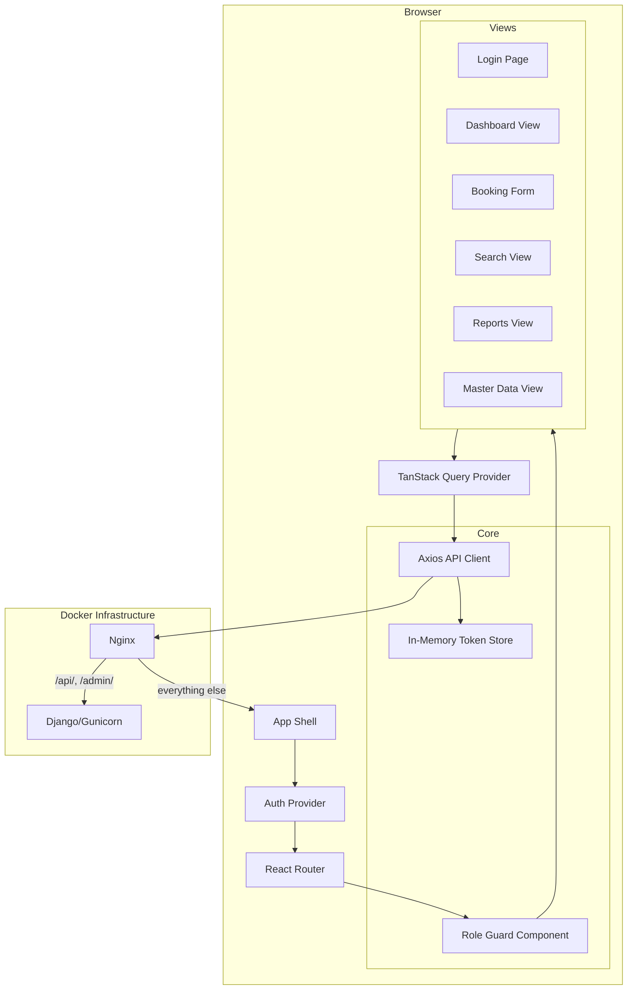
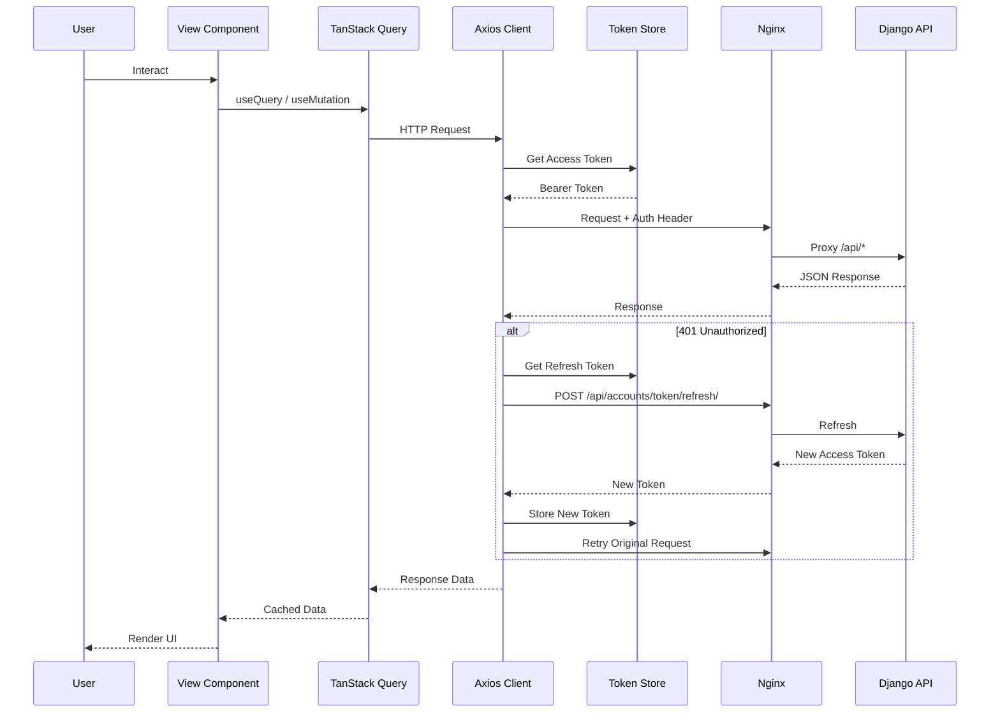
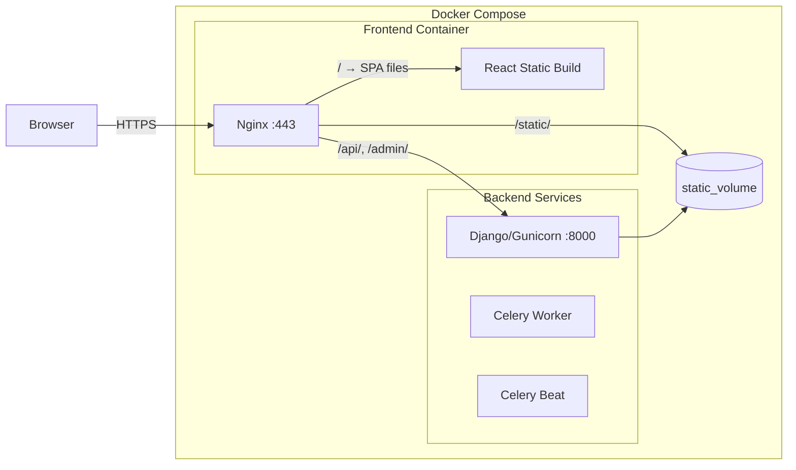

# Design Document: React Frontend

## Overview

This design describes a React single-page application (SPA) that serves as the frontend for the logistics ERP platform at erp.parthsudra.com. The SPA consumes the existing Django REST Framework API (JWT-authenticated) and provides role-based views for booking management, search, reporting, master data administration, and communication history.

The React app is built as a static production bundle and served via Nginx at the root path (`/`). API requests are proxied to the Django backend at `/api/`. The architecture prioritizes:

- **Separation of concerns**: API client, auth, routing, and UI layers are independent
- **Security**: JWT tokens stored only in memory (not localStorage/sessionStorage)
- **Maintainability**: Feature-based folder structure with shared component library
- **Performance**: Code splitting per route, optimistic UI updates where safe

### Technology Stack

| Layer | Technology | Rationale |
|-------|-----------|-----------|
| Framework | React 18 + TypeScript | Type safety, ecosystem maturity |
| Build Tool | Vite | Fast HMR, optimized production builds |
| Routing | React Router v6 | Standard SPA routing with layout nesting |
| State Management | TanStack Query (React Query) | Server-state caching, automatic refetching |
| Forms | React Hook Form + Zod | Performant forms with schema-based validation |
| UI Components | MUI (Material UI) v5 | Production-ready component library with responsive support |
| HTTP Client | Axios | Interceptor-based token attachment and refresh |
| Testing | Vitest + React Testing Library + fast-check | Unit, integration, and property-based testing |

## Architecture

### High-Level Component Architecture



### Data Flow



### Deployment Architecture



The existing `nginx` service in docker-compose is replaced with a multi-purpose container that:
1. Serves the React production build at `/`
2. Proxies `/api/` and `/admin/` to the Django upstream
3. Serves Django static files from the shared volume
4. Handles SSL termination (existing Let's Encrypt certs)

## Components and Interfaces

### Folder Structure

```
frontend/
├── public/
│   └── index.html
├── src/
│   ├── main.tsx                  # Entry point
│   ├── App.tsx                   # Providers + Router setup
│   ├── api/
│   │   ├── client.ts             # Axios instance + interceptors
│   │   ├── endpoints.ts          # API path constants
│   │   └── types.ts              # Shared API response types
│   ├── auth/
│   │   ├── AuthProvider.tsx      # Context provider for auth state
│   │   ├── tokenStore.ts         # In-memory token storage
│   │   ├── useAuth.ts            # Auth hook (login, logout, user)
│   │   └── types.ts              # Auth types
│   ├── router/
│   │   ├── routes.tsx            # Route definitions
│   │   ├── RoleGuard.tsx         # Permission-based route wrapper
│   │   └── routePermissions.ts   # Role-to-route mapping
│   ├── features/
│   │   ├── dashboard/
│   │   │   ├── DashboardPage.tsx
│   │   │   ├── useDashboardData.ts
│   │   │   └── components/
│   │   ├── bookings/
│   │   │   ├── BookingFormPage.tsx
│   │   │   ├── BookingDetailPage.tsx
│   │   │   ├── useBookingForm.ts
│   │   │   ├── useContainers.ts
│   │   │   ├── useTranshipments.ts
│   │   │   ├── schema.ts          # Zod validation schemas
│   │   │   └── components/
│   │   │       ├── ContainerSubForm.tsx
│   │   │       ├── TranshipmentSubForm.tsx
│   │   │       └── NotificationHistory.tsx
│   │   ├── search/
│   │   │   ├── SearchPage.tsx
│   │   │   ├── useBookingSearch.ts
│   │   │   └── components/
│   │   ├── reports/
│   │   │   ├── ReportsPage.tsx
│   │   │   ├── useReports.ts
│   │   │   └── components/
│   │   └── master-data/
│   │       ├── MasterDataPage.tsx
│   │       ├── useMasterData.ts
│   │       └── components/
│   ├── components/               # Shared UI components
│   │   ├── Layout.tsx
│   │   ├── Sidebar.tsx
│   │   ├── LoadingIndicator.tsx
│   │   └── ErrorBoundary.tsx
│   └── utils/
│       ├── dates.ts
│       └── validation.ts
├── Dockerfile                    # Multi-stage build
├── package.json
├── tsconfig.json
├── vite.config.ts
└── vitest.config.ts
```

### Key Module Interfaces

#### 1. Token Store (`src/auth/tokenStore.ts`)

```typescript
interface TokenStore {
  getAccessToken(): string | null;
  getRefreshToken(): string | null;
  setTokens(access: string, refresh: string): void;
  clearTokens(): void;
}
```

Tokens are held in module-scoped variables (closure). No persistence to localStorage/sessionStorage.

#### 2. API Client (`src/api/client.ts`)

```typescript
// Axios instance with interceptors
const apiClient: AxiosInstance;

// Request interceptor: attaches Bearer token
// Response interceptor: on 401 → attempt refresh → retry OR redirect to login
```

The refresh flow uses a promise-based queue: if a refresh is already in progress, subsequent 401 responses wait for the same refresh promise rather than triggering multiple refresh requests.

#### 3. Auth Provider (`src/auth/AuthProvider.tsx`)

```typescript
interface AuthContextValue {
  user: User | null;
  isAuthenticated: boolean;
  login(username: string, password: string): Promise<void>;
  logout(): void;
  role: Role | null;
}

type Role = 'Admin' | 'Operations' | 'Accounts' | 'Sales';

interface User {
  id: number;
  username: string;
  first_name: string;
  last_name: string;
  role: Role;
  marketing_person_id: number | null;
}
```

#### 4. Route Permissions (`src/router/routePermissions.ts`)

```typescript
interface RoutePermission {
  path: string;
  allowedRoles: Role[];
  restrictions?: Record<Role, string[]>; // features to hide per role
}

const routePermissions: RoutePermission[] = [
  { path: '/dashboard', allowedRoles: ['Admin', 'Operations', 'Accounts', 'Sales'] },
  { path: '/bookings/new', allowedRoles: ['Admin', 'Operations'] },
  { path: '/bookings/:id/edit', allowedRoles: ['Admin', 'Operations'] },
  { path: '/bookings/:id', allowedRoles: ['Admin', 'Operations', 'Accounts', 'Sales'] },
  { path: '/search', allowedRoles: ['Admin', 'Operations', 'Accounts', 'Sales'] },
  { path: '/reports', allowedRoles: ['Admin', 'Operations', 'Accounts'] },
  { path: '/master-data', allowedRoles: ['Admin'] },
];
```

#### 5. Booking Form Schema (`src/features/bookings/schema.ts`)

```typescript
// Zod schema for client-side validation
const bookingSchema = z.object({
  booking_date: z.string().pipe(z.coerce.date()),
  booking_validity_date: z.string().pipe(z.coerce.date()),
  forwarding_window_start: z.string().pipe(z.coerce.date()),
  forwarding_window_end: z.string().pipe(z.coerce.date()),
  shipping_line: z.number().positive(),
  pol: z.number().positive(),
  pod: z.number().positive(),
  client: z.number().positive(),
  commodity: z.number().positive(),
  cargo_type: z.enum(['FCL', 'LCL']),
  shipment_type: z.string().min(1),
  stuffing_type: z.string().min(1),
  // ... optional fields
  is_haz: z.boolean().default(false),
  haz_class: z.string().optional(),
  haz_uin: z.string().optional(),
  haz_group: z.string().optional(),
}).refine(data => data.booking_date <= data.booking_validity_date, {
  message: 'Booking date must be on or before validity date',
  path: ['booking_validity_date'],
}).refine(data => data.forwarding_window_start <= data.forwarding_window_end, {
  message: 'Forwarding window start must be on or before end',
  path: ['forwarding_window_end'],
}).refine(data => !data.is_haz || (data.haz_class && data.haz_uin && data.haz_group), {
  message: 'HAZ fields are required when is_haz is true',
  path: ['haz_class'],
});
```

#### 6. Container Sub-Form Schema

```typescript
const containerSchema = z.object({
  container_type: z.number().positive(),
  container_size: z.enum(['20FT', '40FT', '40FT_HC', '45FT']),
  container_count: z.number().int().min(1),
  container_no: z.string().max(20).optional(),
  seal_no: z.string().max(20).optional(),
});
```

#### 7. Transhipment Leg Schema

```typescript
const transhipmentLegSchema = z.object({
  port: z.number().positive(),
  eta: z.string().pipe(z.coerce.date()),
  connecting_vessel_voyage: z.string().min(1).max(200),
  etd: z.string().pipe(z.coerce.date()),
}).refine(data => data.etd > data.eta, {
  message: 'ETD must be after ETA',
  path: ['etd'],
});

// Array-level validation for chronological ordering
const transhipmentLegsSchema = z.array(transhipmentLegSchema)
  .max(4)
  .refine(legs => {
    for (let i = 1; i < legs.length; i++) {
      if (legs[i].eta < legs[i - 1].etd) return false;
    }
    return true;
  }, { message: 'Legs must be in chronological order' });
```

## Data Models

### Frontend TypeScript Types

```typescript
// Booking
interface Booking {
  id: number;
  job_number: string;
  booking_no: string;
  status: 'PENDING' | 'DO_BOOKING_EDIT' | 'COMPLETED';
  booking_date: string;
  booking_validity_date: string;
  forwarding_window_start: string;
  forwarding_window_end: string;
  shipping_line: number;
  pol: number;
  pod: number;
  client: number;
  commodity: number;
  cargo_type: 'FCL' | 'LCL';
  shipment_type: string;
  stuffing_type: string;
  // Optional fields...
  vessel: number | null;
  etd_pol: string | null;
  eta_destination: string | null;
  is_haz: boolean;
  haz_class: string;
  haz_uin: string;
  haz_group: string;
  certificates: string[];
  remarks: string;
  containers: Container[];
  transhipment_legs: TranshipmentLeg[];
  communication_logs: CommunicationLog[];
  created_at: string;
  updated_at: string;
}

// Container
interface Container {
  id: number;
  container_type: number;
  container_size: '20FT' | '40FT' | '40FT_HC' | '45FT';
  container_count: number;
  container_no: string;
  seal_no: string;
}

// Transhipment Leg
interface TranshipmentLeg {
  id: number;
  sequence: number;
  port: number;
  eta: string;
  connecting_vessel_voyage: string;
  etd: string;
}

// Communication Log
interface CommunicationLog {
  id: number;
  email_type: string;
  recipients: string[];
  sent_at: string | null;
  status: string;
  error_message: string;
  created_at: string;
}

// Master Data Entity (generic)
interface MasterDataEntity {
  id: number;
  name: string;
  is_active: boolean;
  created_at: string;
  updated_at: string;
  [key: string]: unknown; // Entity-specific fields
}

// Paginated Response
interface PaginatedResponse<T> {
  count: number;
  next: string | null;
  previous: string | null;
  results: T[];
}

// Dashboard Counts
interface DashboardCounts {
  pending_count: number;
  do_booking_edit_count: number;
  upcoming_etd_count?: number;
  recent_exports_count?: number;
}

// Search Result Row
interface BookingSearchResult {
  id: number;
  job_number: string;
  client: string;
  shipping_line: string;
  pol: string;
  pod: string;
  status: string;
  booking_date: string;
}
```

### API Endpoint Map

| Feature | Method | Endpoint | Notes |
|---------|--------|----------|-------|
| Login | POST | `/api/accounts/token/` | Returns `{access, refresh}` |
| Refresh | POST | `/api/accounts/token/refresh/` | Returns `{access}` |
| User Profile | GET | `/api/accounts/users/me/` | Current user info |
| Dashboard | GET | `/api/bookings/?status=PENDING&page_size=1` | Count via response |
| Search | GET | `/api/bookings/search/?q=` | Paginated results |
| Booking List | GET | `/api/bookings/` | Paginated |
| Booking Create | POST | `/api/bookings/` | Returns created booking |
| Booking Detail | GET | `/api/bookings/{id}/` | Full booking with relations |
| Booking Update | PATCH | `/api/bookings/{id}/` | Partial update |
| Containers List | GET | `/api/bookings/{id}/containers/` | |
| Container Create | POST | `/api/bookings/{id}/containers/` | Single or array |
| Container Delete | DELETE | `/api/bookings/{id}/containers/{cid}/` | 204 |
| Transhipments List | GET | `/api/bookings/{id}/transhipments/` | |
| Transhipments Create | POST | `/api/bookings/{id}/transhipments/` | `{legs: [...]}` |
| Transhipment Update | PUT | `/api/bookings/{id}/transhipments/{lid}/` | |
| Transhipment Delete | DELETE | `/api/bookings/{id}/transhipments/{lid}/` | 204 |
| Master Data List | GET | `/api/master-data/{type}/` | Paginated, `?search=` |
| Master Data Create | POST | `/api/master-data/{type}/` | Admin only |
| Master Data Update | PATCH | `/api/master-data/{type}/{id}/` | Admin only |
| Pending DO Report | GET | `/api/reports/pending-do/` | Filtered, paginated |
| Master Report | GET | `/api/reports/master/` | Filtered, paginated |
| Report Export | GET | `/api/reports/{type}/export/?format=csv` | File download |


## Correctness Properties

*A property is a characteristic or behavior that should hold true across all valid executions of a system — essentially, a formal statement about what the system should do. Properties serve as the bridge between human-readable specifications and machine-verifiable correctness guarantees.*

### Property 1: Bearer Token Attachment Invariant

*For any* API request configuration (any HTTP method, any URL path, any request body) made while an access token is present in the token store, the Axios request interceptor SHALL attach the token as a `Bearer` authorization header on the outgoing request.

**Validates: Requirements 1.4**

### Property 2: Token Storage Exclusion

*For any* token string value, after calling `setTokens(access, refresh)` or after a successful login, neither `localStorage` nor `sessionStorage` SHALL contain that token value in any key.

**Validates: Requirements 1.8**

### Property 3: Protected Route Redirect Preservation

*For any* valid protected route path and any unauthenticated state (no access token in memory), navigating to that path SHALL store the requested path and render the login page instead of the target view. After successful authentication, navigation SHALL proceed to the originally requested path.

**Validates: Requirements 2.1, 2.2**

### Property 4: Role-Route Access Denial Without Logout

*For any* authenticated user with role R and any route path P where P is not in role R's allowed routes, navigating to P SHALL display an unauthorized access message and a link to Dashboard, while the user's authentication state SHALL remain intact (tokens not cleared, user not redirected to login).

**Validates: Requirements 2.3**

### Property 5: Validation Error Field Mapping

*For any* subset of booking form fields that appear in an API 400 validation error response, each error message SHALL be displayed adjacent to its corresponding form field, and all user-entered data across all form fields SHALL be preserved (no field values cleared).

**Validates: Requirements 4.7**

### Property 6: Booking Date Ordering Validation

*For any* pair of dates where `booking_date > booking_validity_date`, the booking form schema validation SHALL produce an error on `booking_validity_date`. *For any* pair of dates where `forwarding_window_start > forwarding_window_end`, the schema validation SHALL produce an error on `forwarding_window_end`. *For any* dates satisfying both ordering constraints, no date-ordering error SHALL be produced.

**Validates: Requirements 4.8**

### Property 7: Container Entry Schema Validation

*For any* container entry object: if `container_type` is missing, or `container_size` is not one of `['20FT', '40FT', '40FT_HC', '45FT']`, or `container_count < 1`, validation SHALL reject the entry. Additionally, *for any* `container_no` or `seal_no` string with length > 20 characters, validation SHALL reject the entry. *For any* entry satisfying all constraints, validation SHALL pass.

**Validates: Requirements 5.2, 5.3**

### Property 8: Transhipment Leg Chronological Validation

*For any* array of transhipment legs (1–4 entries): if any leg has `etd ≤ eta`, validation SHALL fail for that leg. If legs are ordered such that `legs[i].eta < legs[i-1].etd` for any consecutive pair, validation SHALL fail indicating chronological order violation. *For any* array where all legs have `etd > eta` and consecutive legs satisfy `legs[i].eta ≥ legs[i-1].etd`, validation SHALL pass.

**Validates: Requirements 6.3**

### Property 9: Search Query Length Gating

*For any* search input string with length 0 (empty) or length > 100 characters, the Search_View SHALL NOT dispatch an API request. *For any* search input string with length between 1 and 100 (inclusive), the Search_View SHALL dispatch the API request with the query.

**Validates: Requirements 7.1**

## Error Handling

### Strategy

Error handling follows a layered approach:

| Layer | Responsibility | Mechanism |
|-------|---------------|-----------|
| API Client (Axios) | Network errors, 401 refresh, 5xx | Interceptors with retry for auth |
| TanStack Query | Retry policy, error state propagation | `retry: 1` for mutations, `retry: 3` for queries |
| Component Level | User-facing error messages, retry actions | `error` state from `useQuery`/`useMutation` |
| Error Boundary | Unhandled React errors | Top-level fallback UI |

### Error Categories

1. **Authentication Errors (401)**
   - Interceptor attempts token refresh exactly once
   - On refresh failure: clear tokens, redirect to `/login`
   - Concurrent requests queue behind the refresh promise

2. **Authorization Errors (403)**
   - Display "Access Denied" message in the current view
   - Do NOT redirect to login (user is still authenticated)
   - Log the attempt for debugging

3. **Validation Errors (400)**
   - Map `{ field: [errors] }` response to form field positions
   - Display inline error messages adjacent to each invalid field
   - Preserve all entered form data

4. **Not Found (404)**
   - Display "Resource not found" message
   - Provide navigation back to list view

5. **Conflict (409)**
   - Display specific message (e.g., "Entity is in use and cannot be deleted")
   - Preserve current state

6. **Network / Server Errors (5xx, timeout)**
   - Display generic "Something went wrong" message
   - Provide retry action button
   - TanStack Query automatic retry handles transient failures

### Loading States

- API requests pending > 300ms trigger a non-blocking loading indicator (thin progress bar at top of viewport)
- Indicator removed within 100ms of response arrival
- Form submissions show inline loading state on the submit button (disabled + spinner)

## Testing Strategy

### Test Framework Configuration

- **Test Runner**: Vitest (compatible with Vite, fast execution)
- **Component Testing**: React Testing Library (user-centric assertions)
- **Property-Based Testing**: fast-check (TypeScript-native PBT library)
- **Mocking**: MSW (Mock Service Worker) for API mocking at the network level

### Test Categories

#### 1. Property-Based Tests (fast-check)

Each correctness property from the design document is implemented as a single property-based test with minimum 100 iterations.

| Property | Test File | What Varies |
|----------|-----------|-------------|
| P1: Bearer Token Attachment | `api/client.test.ts` | HTTP method, URL path, body shape |
| P2: Token Storage Exclusion | `auth/tokenStore.test.ts` | Token string values (unicode, special chars) |
| P3: Protected Route Redirect | `router/RoleGuard.test.tsx` | Route paths from permission list |
| P4: Role-Route Access Denial | `router/RoleGuard.test.tsx` | (Role, Route) pairs not in allowed set |
| P5: Validation Error Mapping | `features/bookings/BookingForm.test.tsx` | Random subsets of field error keys |
| P6: Date Ordering Validation | `features/bookings/schema.test.ts` | Random date pairs |
| P7: Container Schema | `features/bookings/schema.test.ts` | Random container objects |
| P8: Transhipment Chronological | `features/bookings/schema.test.ts` | Random datetime arrays |
| P9: Search Query Length | `features/search/SearchPage.test.tsx` | Random strings of varying length |

Each test is tagged with:
```typescript
// Feature: react-frontend, Property 6: Booking Date Ordering Validation
```

**Configuration**: Each property test runs with `{ numRuns: 100 }` minimum.

#### 2. Example-Based Unit Tests

- Login flow (success, failure, empty fields)
- Dashboard rendering per role
- Booking form conditional HAZ fields
- Master data CRUD operations
- Notification history rendering (failed status styling, null sent_at)
- Responsive sidebar behavior at breakpoints

#### 3. Integration Tests

- Full booking create/edit flow with mocked API (MSW)
- Token refresh interceptor chain
- Report export file download trigger
- Master data dropdown loading and error states

#### 4. Accessibility Tests

- Keyboard navigation through forms
- ARIA labels on interactive elements
- Focus management after form submission
- Screen reader announcements for errors

### Test Execution

```bash
# Run all tests (single execution, no watch)
npx vitest --run

# Run property tests only
npx vitest --run --testPathPattern=".*\\.test\\.(ts|tsx)$" --grep="Property"

# Run with coverage
npx vitest --run --coverage
```
