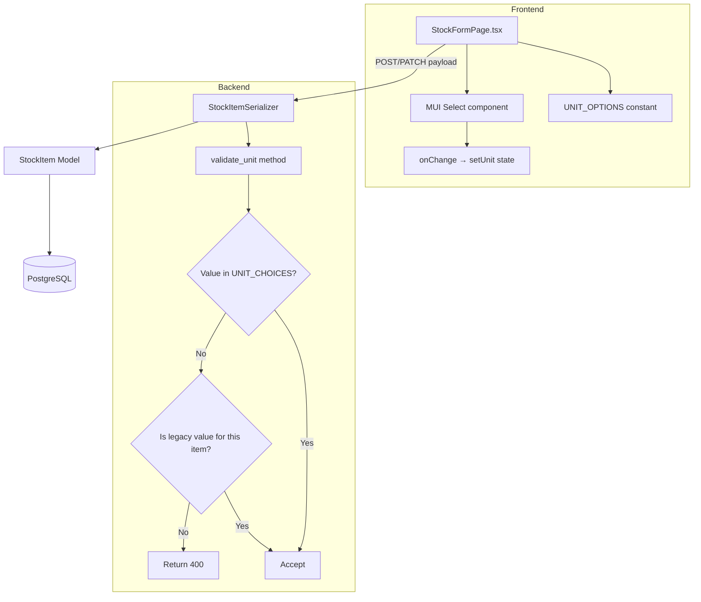

# Design Document: Unit Dropdown

## Overview

This feature replaces the free-text "Unit" `TextField` on the Stock Item form with a Material UI `Select` dropdown component populated with predefined unit options. The change spans both the frontend (React/MUI) and backend (Django REST Framework), including model-level choices, serializer validation with backward-compatible legacy value handling, and a migration that preserves existing data.

The design prioritizes backward compatibility: existing stock items with non-standard unit values remain fully functional, and the backend conditionally bypasses validation for legacy values already persisted for a given item.

## Architecture



## Components and Interfaces

### Frontend Components

#### `UNIT_OPTIONS` constant

A shared constant array defining the dropdown options, exported from a new file `frontend/src/features/inventory/unitOptions.ts`:

```typescript
export interface UnitOption {
  value: string;
  label: string;
}

export const UNIT_OPTIONS: UnitOption[] = [
  { value: 'units', label: 'Units' },
  { value: 'kg', label: 'Kilograms (kg)' },
  { value: 'bags', label: 'Bags' },
  { value: 'tonnes', label: 'Tonnes' },
  { value: 'litres', label: 'Litres' },
  { value: 'meters', label: 'Meters' },
  { value: 'pieces', label: 'Pieces' },
  { value: 'boxes', label: 'Boxes' },
  { value: 'cartons', label: 'Cartons' },
  { value: 'pallets', label: 'Pallets' },
];
```

#### `StockFormPage.tsx` modifications

- Replace `<TextField label="Unit" ...>` with `<Select>` + `<MenuItem>` elements.
- Detect legacy values: if the loaded stock item's `unit` value is not in `UNIT_OPTIONS`, append it to the rendered menu items with a "(legacy)" suffix label.
- After a successful save that changed from a legacy value to a standard value, the legacy option is no longer needed (the form re-renders from fresh API data).

### Backend Components

#### `inventory/models.py` — `StockItem` model

Add a `UNIT_CHOICES` tuple constant at the module level and reference it in the field definition's `choices` parameter. The `choices` parameter provides Django admin/form integration but does not add a database-level constraint.

```python
UNIT_CHOICES = [
    ('units', 'Units'),
    ('kg', 'Kilograms (kg)'),
    ('bags', 'Bags'),
    ('tonnes', 'Tonnes'),
    ('litres', 'Litres'),
    ('meters', 'Meters'),
    ('pieces', 'Pieces'),
    ('boxes', 'Boxes'),
    ('cartons', 'Cartons'),
    ('pallets', 'Pallets'),
]

# In StockItem model:
unit = models.CharField(max_length=50, default='units', choices=UNIT_CHOICES)
```

#### `inventory/serializers.py` — `StockItemSerializer`

Add a custom `validate_unit` method that:

1. On create: validates the unit is in the allowed choices (or defaults to `'units'` if empty/omitted).
2. On update: allows the value if it's in the choices list OR if it matches the current persisted value for that instance (legacy bypass).

```python
def validate_unit(self, value):
    valid_values = [choice[0] for choice in UNIT_CHOICES]
    if value in valid_values:
        return value
    # Legacy bypass: allow if updating and value matches current DB value
    if self.instance and self.instance.unit == value:
        return value
    raise serializers.ValidationError(
        f"Invalid unit. Accepted values: {', '.join(valid_values)}"
    )
```

#### Migration

A new migration that modifies the `unit` field to add `choices=UNIT_CHOICES`. This migration:
- Uses `AlterField` to update metadata only.
- Does NOT add a database CHECK constraint.
- Does NOT run any data migration.

## Data Models

### StockItem Model (updated field)

| Field | Type | Constraints | Notes |
|-------|------|-------------|-------|
| unit | CharField(max_length=50) | default='units', choices=UNIT_CHOICES | No DB-level constraint; validation is serializer-level |

### Unit Options (shared definition)

| Value | Display Label |
|-------|--------------|
| units | Units |
| kg | Kilograms (kg) |
| bags | Bags |
| tonnes | Tonnes |
| litres | Litres |
| meters | Meters |
| pieces | Pieces |
| boxes | Boxes |
| cartons | Cartons |
| pallets | Pallets |

## Correctness Properties

*A property is a characteristic or behavior that should hold true across all valid executions of a system — essentially, a formal statement about what the system should do. Properties serve as the bridge between human-readable specifications and machine-verifiable correctness guarantees.*

### Property 1: Edit form correctly displays any unit value

*For any* stock item with any unit value (whether a standard option or an arbitrary legacy string), the edit form shall render with that value pre-selected in the dropdown, and if the value is not in the standard options list, it shall appear as an additional selectable menu item.

**Validates: Requirements 2.4, 2.5, 4.1, 4.3**

### Property 2: Backend validation accepts exactly valid units and rejects invalid ones

*For any* string submitted as the unit field value in a create request, the API shall return a successful response if and only if the value is a member of the predefined UNIT_CHOICES list (or is empty/omitted, in which case it defaults to "units"). All other values shall produce a 400 response.

**Validates: Requirements 3.1, 3.2, 3.3**

### Property 3: Legacy values preserved on update

*For any* stock item that has a persisted unit value not in the standard UNIT_CHOICES list, submitting an update request that includes or preserves that same legacy unit value shall be accepted by the API without validation failure, and the unit value shall remain unchanged in the database.

**Validates: Requirements 3.5, 4.4**

### Property 4: Legacy value removed after replacement

*For any* stock item with a legacy unit value, if the user updates it to a standard UNIT_CHOICES value and the save succeeds, then on subsequent retrieval and form rendering, the previous legacy value shall no longer appear as a selectable option in the dropdown.

**Validates: Requirements 4.5**

## Error Handling

| Scenario | Frontend Behavior | Backend Behavior |
|----------|-------------------|------------------|
| Invalid unit submitted | Should not occur (dropdown constrains choices) | Returns 400 with message listing valid values |
| Empty/omitted unit on create | Dropdown defaults to "units", so submit always has a value | Serializer defaults to "units" if empty/omitted |
| Legacy value on update | Shows legacy value in dropdown; user can keep or change | Accepts if value matches current DB value |
| Network error on save | Displays generic error alert via existing error handling | N/A |
| Stock item fetch fails (edit mode) | Displays existing "Failed to load" error alert | Returns 404/500 as appropriate |

## Testing Strategy

### Backend Tests (pytest + hypothesis)

**Unit tests:**
- Verify `UNIT_CHOICES` contains exactly the expected values in order.
- Verify serializer defaults unit to "units" when omitted or empty on create.
- Verify serializer rejects invalid unit on create (specific examples: empty string after trimming, random invalid string).
- Verify migration does not add a DB-level CHECK constraint on unit field.

**Property-based tests (hypothesis):**
- **Property 2**: Generate random strings via `hypothesis.strategies.text()`. For each generated string, assert: if it's in the valid set → serializer accepts; if not → serializer rejects with 400. Minimum 100 iterations.
  - Tag: `Feature: unit-dropdown, Property 2: Backend validation accepts exactly valid units and rejects invalid ones`
- **Property 3**: Generate random non-standard unit strings via `hypothesis.strategies.text().filter(lambda s: s not in valid_set)`. Create a stock item with that legacy value, then submit an update preserving the legacy unit. Assert 200 response and unit unchanged. Minimum 100 iterations.
  - Tag: `Feature: unit-dropdown, Property 3: Legacy values preserved on update`

### Frontend Tests (vitest + fast-check + testing-library)

**Unit tests:**
- Verify `UNIT_OPTIONS` constant contains the correct values and labels.
- Verify form renders a Select component (not a TextField) for the unit field.
- Verify default selection is "units" in create mode.
- Verify grid layout props are preserved (xs=12, sm=6, md=3).

**Property-based tests (fast-check):**
- **Property 1**: Generate random stock item objects with random unit strings (mix of valid and invalid). Render the edit form with that data. Assert the select value matches the stock item's unit, and if not in UNIT_OPTIONS, assert an additional menu item with "(legacy)" label exists. Minimum 100 iterations.
  - Tag: `Feature: unit-dropdown, Property 1: Edit form correctly displays any unit value`
- **Property 4**: Generate random legacy unit strings, simulate an edit that saves a standard value, then re-render. Assert the legacy option no longer appears. Minimum 100 iterations.
  - Tag: `Feature: unit-dropdown, Property 4: Legacy value removed after replacement`

### Integration Tests

- End-to-end create flow: select a unit from dropdown, submit, verify API receives correct value.
- End-to-end edit flow: load existing item with standard unit, change it, save, verify persistence.
- Legacy value workflow: load item with non-standard unit, verify dropdown shows it, select a new value, save, reload and verify legacy is gone.
